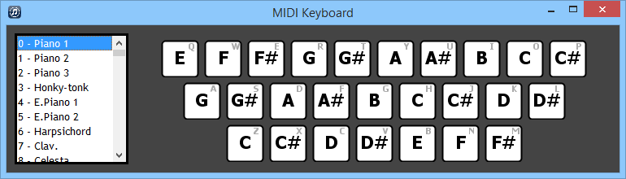

 Midi Keyboard
==============

Music at your fingertips.
On a QWERTY keyboard there are three rows of alphabetical keys. 
**Midi Keyboard** maps each key to a note.
The key with the lowest pitch begins at the key 'Z' and highest at 'P'
so pitch increases left-to-right along each row continuing at the beginning of the next row above.

